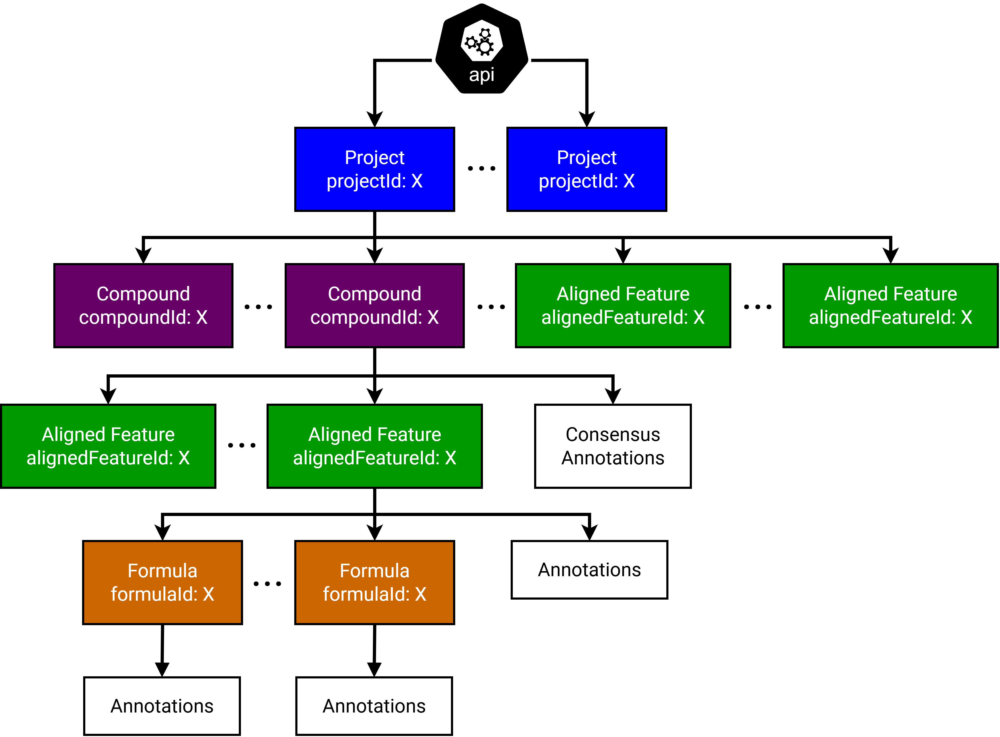

# Summary

Metabolomics plays a crucial role in understanding biological systems, with mass spectrometry being the method of choice
for analyzing complex metabolite mixtures, due to its high sensitivity and throughput. However, compound annotation
remains a major bottleneck in metabolomics workflows, as for the majority of detected signals no reference spectra are
found in spectral libraries. This co-called "dark metabolome" [@dasilva15illuminating]
necessitates approaches that can annonate metabolites without relying on spectral library matching.
SIRIUS [@boecker09sirius; @duehrkop19sirius4] is a comprehensive software framework for annotating
metabolites and other small molecules from tandem mass spectrometry (MS/MS) data without the need of reference
spectra, while still supporting spectral matching when reference spectra are available.

Here, we introduce a RESTful API for SIRIUS that adheres to the OpenAPI Specification.
This enables programmatic access and seamless integration of SIRIUS into computational workflows while
future-proofing projects towards later changes by separating the storage layer from the access layer. Built on this
foundation, we present *PySirius* and *RSirius*, client libraries for Python and R available via conda-forge, alongside
a SIRIUS Java SDK. These clients facilitate integration into bioinformatics pipelines, statistical analyses, data
visualization workflows, and other software. Actively maintained on GitHub, the API and client libraries democratize
access to state-of-the-art metabolite annotation and enable reproducible research practices in computational
metabolomics.

# Statement of need

Many specialized metabolomics tools, including SIRIUS for annotation of MS/MS
spectra with molecular formulas, structures, and compound classes, are designed
as standalone applications accessed through command-line or graphical
interfaces. Clearly, a graphical user interface is of massive value for allowing
inexperienced user accessing a computational tool [@ludwig20denovo]. Yet, this
architecture also creates barriers for the integration into automated
computational workflows and advanced data mining: Users must parse text outputs
or intermediate files, and cannot access granular results programmatically.

This challenge was exemplified in SIRIUS 5, where a project directory of plain-text files served as both the storage
layer and the primary point of user access. This tight coupling created a difficult dilemma: either break established
user workflows by changing file formats to add new features, or hinder innovation to maintain backward compatibility.
The transition to an embedded database in SIRIUS 6 solved the innovation bottleneck, but by removing direct file access,
it increases the barrier for users needing to programmatically integrate SIRIUS results.

The SIRIUS API addresses these limitations by providing programmatic access to all SIRIUS capabilities through a
standardized, storage-independent interface. This decoupled architecture separates the data storage layer from the data
access layer. It enables direct retrieval of specific information at any granularity, and allows true integration into
existing data analysis environments while simultaneously permitting the internal storage formats to evolve without
breaking user-facing compatibility.

Furthermore, the SIRIUS API enables a more interactive data analysis paradigm. Users are no longer required to load
entire project spaces (which can be gigabytes in size) into memory. Instead, they can fetch specific, fine-grained
results on demand or selectively perform (re-)computations with new parameters.

While the API is language-agnostic and accessible via standard HTTP libraries, dedicated client libraries for Python and
R further streamline integration. Python and R dominate metabolomic data analysis, backed by libraries like
*pyOpenMS* [@roest14pyopenms], *matchms* [@huber20matchms], and the RforMassSpectrometry initiative including
*Spectra* and *Metabonaut* [@louail25metabonaut].
*PySirius* and *RSirius* bring SIRIUS into these established ecosystems, enabling
seamless workflows alongside statistical analyses, visualizations, and machine learning models.

SIRIUS integrations for multiple widely used mass spectrometry tools such
as [MZmine](https://github.com/mzmine/mzmine) (v4.8) [@schmid23integrative],
[Agilent MassHunter Exporer](https://www.agilent.com/en/product/software-informatics/mass-spectrometry-software/data-analysis/masshunter-explorer?srsltid=AfmBOooKj49bqc4ATAFIGmMQdir5twRaO5ClaSnHTnW8j68m7a3ZQUUQ#videos)
(v2.0) and [*RuSirius*](https://github.com/rformassspectrometry/RuSirius) (RforMassSpectrometry)
are already based on the SIRIUS API, further demonstrating community demand for
programmatic access to SIRIUS.

# SIRIUS API

The SIRIUS Application Programming Interface (API), initially released with SIRIUS version 6.0.0, is a major
architectural update that offers several strategic advantages:

### Comprehensive programmatic access to functionality

The API exposes the complete spectrum of SIRIUS analytical
capabilities through programmatic interfaces, encompassing spectral library searching,
computation of fragmentation trees [@boecker08towards; @boecker16fragmentation],
annotation of molecular formulas [@duehrkop13molecular] (orange in \autoref{fig:hierarchy}),
structure database search with CSI:FingerID [@duehrkop15searching],
compound class prediction with CANOPUS [@duehrkop21systematic],
*de novo* molecular structure prediction with MSNovelist [@stravs21msnovelist]
and additional methods.
This avoids the need to parse command-line interface outputs or manipulate
intermediate file formats.

### Fine-grained and direct data retrieval

The API allows direct retrieval of specific data elements at
arbitrary levels of granularity (\autoref{fig:hierarchy}). This spans from individual feature-level results to
project-wide summaries, thereby enabling more efficient and precisely targeted analytical workflows.

### Decoupled architectural design

The API separates the data persistence layer from the data access layer, which permits modifications to core SIRIUS
functionality without invalidating existing project data structures. This architectural decision ensures forward
compatibility for future SIRIUS updates, addressing the compatibility limitations encountered during the transition
from SIRIUS version 5 to 6.

### Platform-agnostic integration capabilities

The implementation according to the OpenAPI Specification guarantees
that SIRIUS functionality remains accessible from any programming language ecosystem equipped with standard HTTP
communication libraries.



## API Architecture

The core of the API consists of modules that enable programmatic control over the small molecule annotation workflow.
These modules operate on the hierarchical structure of a SIRIUS project (\autoref{fig:hierarchy}), which typically
correlates to one LC-MS/MS
experiment that can include multiple runs. SIRIUS operates on preprocessed data, accepting either preprocessed spectral
inputs or raw mzML files that undergo automated preprocessing. This hierarchy begins at the molecular level, where
compounds (purple in \autoref{fig:hierarchy}) represent individual chemical entities. During mass spectrometric
analysis, a single compound can generate multiple features, signals from molecules or ions detected across experimental
runs, encompassing different ionization states that vary in retention time and mass-to-charge ratio. Alignment of these
features over the different runs produces aligned features (green in \autoref{fig:hierarchy}), the main access point for
annotations in SIRIUS. This one-to-many relationship enables SIRIUS to provide consensus annotations by integrating
evidence across features associated with the same compound. The API focuses on enabling programmatic access to molecular
annotations rather than low-level signal processing, though experimental data like traces remain accessible when needed

### Projects API

The projects API module administers SIRIUS project spaces (blue in \autoref{fig:hierarchy}), which are isolated
computational environments containing input spectral data and associated analysis results.
This module allows to manage (create, open, close, delete) projects
and import mass spectrometry data from various formats. It further provides access to prediction vector definitions
utilized by CSI:FingerID and CANOPUS.

### Compounds API

The compounds API module manages compound entities (purple in \autoref{fig:hierarchy}) within projects.
Compound manipulation operations encompass addition, deletion, and information retrieval.

### Features API

The features API module facilitates manipulation of aligned features (green in \autoref{fig:hierarchy}) as well as
retrieval of their associated annotation results. Analogous to the compounds API, available operations include addition,
deletion, and information retrieval. Accessible annotations include essentially all computational results generated by
methods
implemented within SIRIUS.

### Searchable Databases API

The searchable databases API module manages custom spectral and structural database resources.
This module supports creation and deletion of custom databases, import of new entries into existing
databases, retrieval of database metadata, and enumeration of all custom and built-in databases
available within the SIRIUS environment. As spectra must be annotated with a structure,
any spectral library also functions as a structure database.

### Jobs API

The jobs API module controls annotation job workflows. Users can define custom job configurations specifying which
analytical methods to apply to designated datasets. These jobs can then be executed, monitored, terminated, or deleted
as needed. Job configurations can be saved for reuse, and their command-line equivalents retrieved for reproducibility.

# Client libraries

Built on the RESTful API, *PySirius*, *RSirius*, and a Java client library provide idiomatic interfaces for Python, R,
and Java users, respectively. The libraries are automatically generated from the OpenAPI specification using
the [OpenAPI Generator](https://github.com/OpenAPITools/openapi-generator), occasionally requiring custom templates and
automated patches for full compatibility. The SIRIUS development team actively maintains all client libraries to ensure
continued compatibility and feature parity with the API.

All client libraries include `SiriusSDK` helper classes that manage the SIRIUS REST service lifecycle. These classes
enable starting the service from within code with automated process detection, shutdown and restart capabilities,
and attachment to existing instances. Methods return a central API client for streamlined access to all API modules and
endpoints.
Researchers can now analyze tandem mass spectrometry data with SIRIUS using standard Python, R and Java code. This
includes
loading data, running jobs, and retrieving results without leaving their analytical environment. The clients enable
sharing
of complete workflows in contained environments rather than describing multi-tool methodologies.

## Existing integrations

The Java client has enabled integration of SIRIUS into major metabolomics
platforms. [MZmine](https://github.com/mzmine/mzmine) has incorporated SIRIUS
functionality directly into its workflow since version 4.8, while
Agilent's [Mass Hunter Explorer](https://www.agilent.com/en/product/software-informatics/mass-spectrometry-software/data-analysis/masshunter-explorer?srsltid=AfmBOooKj49bqc4ATAFIGmMQdir5twRaO5ClaSnHTnW8j68m7a3ZQUUQ#videos)
v2.0 integrates SIRIUS
capabilities through a proprietary client implementation. The RforMassSpectrometry initiative is currently adapting
*RSirius* as the foundation for [
*RuSirius*](https://github.com/rformassspectrometry/RuSirius).

## Updates and maintainability

A CI/CD pipeline automatically generates and tests the R and Python client libraries against the latest
SIRIUS API for each new release. The new client versions are subsequently published to conda-forge. This automated
workflow ensures the client libraries remain maintainable, up-to-date, and resilient as new clients are added. The
SIRIUS Java SDK is part of the SIRIUS main application and is therefore built and distributed alongside it.

## Expandability and contribution

The OpenAPI specification enables generation of client libraries for
any [supported programming language](https://openapi-generator.tech/docs/generators/) of the OpenAPI Generator.
We welcome community contributions of additional client libraries and relegate interested readers
to
our [contribution guidelines](https://github.com/sirius-ms/sirius-client-openAPI/tree/master?tab=readme-ov-file#contributing-sirius-client-libraries).

# Installation via conda-forge

Installation of either *PySirius* or *RSirius* via conda-forge automatically installs SIRIUS as a dependency.

```
conda install -c conda-forge py-sirius-ms   # Python client library (PySirius)
conda install -c conda-forge r-sirius-ms    # R client library (RSirius)
conda install -c conda-forge sirius-ms      # SIRIUS (included in the above)
```

# Examples and documentation

Minimalistic examples illustrating the fundamental usage of
[*RSirius*](https://github.com/sirius-ms/sirius-client-openAPI/tree/master/client-api_r#example-usage-of-rsirius) and
[*PySirius*](https://github.com/sirius-ms/sirius-client-openAPI/tree/master/client-api_python#example-usage-of-pysirius)
are provided within
the client library source code repository.
Exemplary implementations demonstrating the usage of individual functions corresponding to
each [API module](#api-architecture) are available in
the test suites for [
*RSirius*](https://github.com/sirius-ms/sirius-client-openAPI/tree/master/client-api_r/generated/tests/testthat) and [
*PySirius*](https://github.com/sirius-ms/sirius-client-openAPI/tree/master/client-api_python/generated/test).
Comprehensive documentation for [
*RSirius*](https://github.com/sirius-ms/sirius-client-openAPI/blob/master/client-api_r/generated/README.md#documentation-for-api-endpoints)
and [
*PySirius*](https://github.com/sirius-ms/sirius-client-openAPI/blob/master/client-api_python/generated/README.md#documentation-for-api-endpoints)
is also provided in the repository.

# Availability

Both the [client library source code](https://github.com/sirius-ms/sirius-client-openAPI) and
the [SIRIUS source code](https://github.com/sirius-ms/sirius) are openly available on GitHub. The client libraries are
distributed via conda-forge as [py-sirius-ms](https://anaconda.org/conda-forge/py-sirius-ms) (*PySirius*)
and [r-sirius-ms](https://anaconda.org/conda-forge/r-sirius-ms) (*RSirius*). SIRIUS itself is available via conda-forge
as [sirius-ms](https://anaconda.org/conda-forge/sirius-ms) or as
direct [releases](https://github.com/sirius-ms/sirius/releases) on GitHub.
The Java client is hosted on a GitLab [package registry](https://gitlab.com/bright-giant/registry-public/-/packages/),
and the SIRIUS API implementation is part of the
[SIRIUS repository](https://github.com/sirius-ms/sirius/tree/stable/sirius_rest_service).

# Competing interests

MF, ML, MAH, KD and SB are co-founders of Bright Giant GmbH.

# Acknowledgements

NAH, SB, MAH and MEL are supported by the Thüringer Ministerium für
Wirtschaft, Wissenschaft und Digitale Gesellschaft (TMWWDG) with
funds from the European Union as part of the European Regional
Development Fund (ERDF, 2023 VFE 0003 and 0029).

# References
